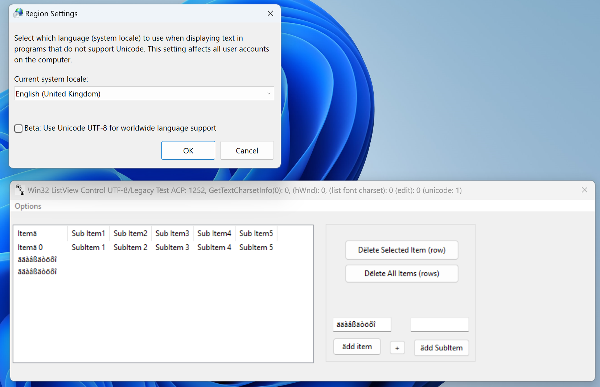
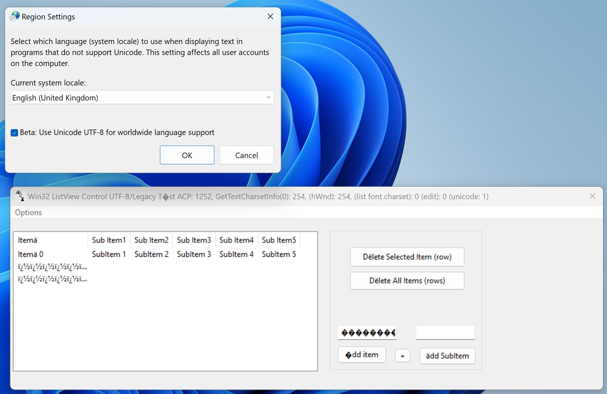
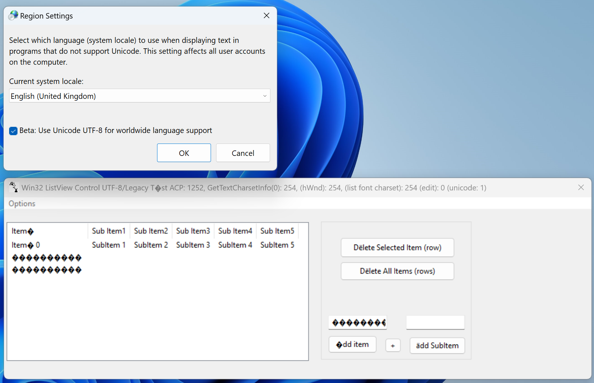

# listview win32 app on UTF-8 system code page
to demonstrate a UTF-8 system code page bug when using manifest activecodepage 'Legacy' on a win32 ANSI app

# reproduce 
### system code page 1252

First compile and run the listview.exe app on Windows11 with a system code page NOT set to UTF-8 but to a 1252 code page.

You will see a window with a list control and some buttons and edit controls. In there you will see some texts with accented chars. As excepted.

### system code page UTF-8

Then, via Settings->Time and Language->Language & Region->Administrative Language Settings->Change System Locale,
enable: 'Beta: Use Unicode UTF-8 for worldwide language support'

Restart.

The app has a manifest with the following in it:

    <?xml version="1.0" encoding="UTF-8" standalone="yes"?>      
    <assembly xmlns="urn:schemas-microsoft-com:asm.v1" xmlns:asmv3="urn:schemas-microsoft-com:asm.v3" manifestVersion="1.0">  
    <dependency>   
    <dependentAssembly>  
    <assemblyIdentity type="win32" name="Microsoft.Windows.Common-Controls" version="6.0.0.0" processorArchitecture="*" publicKeyToken="6595b64144ccf1df"   language="*"/>  
    </dependentAssembly> 
    </dependency>  
      <asmv3:assemblyIdentity type="win32" name="listview" version="1.0.0.0"/> 
      <asmv3:application>  
        <asmv3:windowsSettings xmlns="http://schemas.microsoft.com/SMI/2019/WindowsSettings">  
         <activeCodePage>Legacy</activeCodePage>  
        </asmv3:windowsSettings>  
      </asmv3:application>  
    </assembly>

That should tell Windows 11 to use a 1252 active code page for the app.

Now run the app again. You will notice that the texts will not display the accented chars correctly.

In the title bar various window charsets are displayed. See that they are 254 (new UTF-8 charset) but should be 0 (ANSI_CHARSET).

Even using 'en-US' or 'de-DE' as activecodepage shows the bug

# Even worse

When changing in the file 'listview.rsrc.rc' the following line the ANSI_CHARSET (0):

    FONT 9, "Segoe UI", 0, 0, 0
to DEFAULT_CHARSET (1)

    FONT 9, "Segoe UI", 0, 0, 1
    
The listview texts are wrong too!

Trying to call SetFont on an CEdit control with a font which has its charset set to ANSI_CHARSET doesn't help. Calling:

   	auto hdc = m_edit.GetWindowDC();
	auto charset = (BYTE)::GetTextCharsetInfo(hdc->GetSafeHdc(), NULL, 0);
    
reveals 254! The new UTF8_CHARSET.

